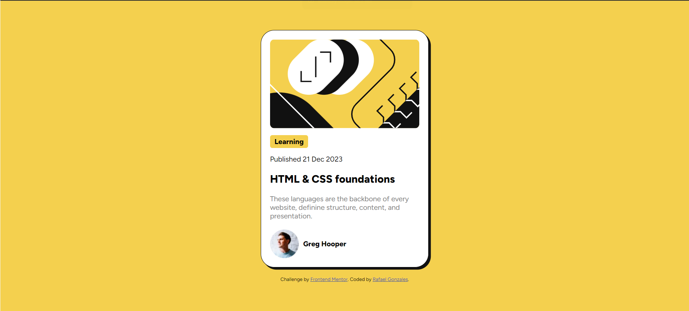

# Frontend Mentor - Blog preview card solution

This is a solution to the [Blog preview card challenge on Frontend Mentor](https://www.frontendmentor.io/challenges/blog-preview-card-ckPaj01IcS). Frontend Mentor challenges help you improve your coding skills by building realistic projects.

## Table of contents

- [Overview](#overview)
  - [The challenge](#the-challenge)
  - [Screenshot](#screenshot)
  - [Links](#links)
- [My process](#my-process)
  - [Built with](#built-with)
  - [What I learned](#what-i-learned)
  - [Continued development](#continued-development)
  - [Useful resources](#useful-resources)
- [Author](#author)

**Note: Delete this note and update the table of contents based on what sections you keep.**

## Overview

### The challenge

Users should be able to:

- See hover and focus states for all interactive elements on the page

### Screenshot

### Links

- Solution URL: [Add solution URL here](https://your-solution-url.com)
- Live Site URL: [Add live site URL here](https://your-live-site-url.com)

## My process

### Built with

- Semantic HTML5 markup
- CSS custom properties
- Flexbox

### What I learned

As someone who has been learning front-end web development for only a couple months I was pretty proud of the way it turned out. I did this challenge with just HTML/CSS, no libraries or the like since I wanted to solidify my foundational skills more, plus I have yet to learn the libraries. I learned alot about how I thought through the challenge and how it translated on code. Breaking down each individual element was something that I focused in on because looking at the big picture was something I was more used too. I used many 
 elements and added a different class to every single one of them, which I think there's probably a better way of doing things. I'm pretty proud of myself for keeping my code pretty organized, and I had used variables and try to keep it as DRY as possible, although I think there's still things I can probably make more DRY.

### Continued development

As I move forward I definitely want to make a solid CSS Reset template sheet for myself so I can get right into the nitty-gritty of things. I'm still familirializing myself with display properties and just getting things to line up / spaced well in general, so that's something I'll keep looking out for in future projects.

### Useful resources

- [Resource](https://developer.mozilla.org/en-US/) - Always a good resource and I come back to this always like many others.

## Author

- Github - [My Github profile](https://github.com/rafaelgonzales612)
- Frontend Mentor - [My Frontend mentor profile](https://www.frontendmentor.io/profile/rafaelgonzales612)
- Website - [My portoflio website](https://www.gonzalesrafael.com/)
